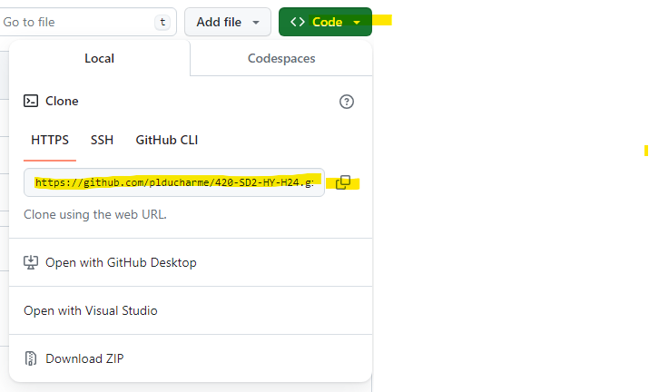
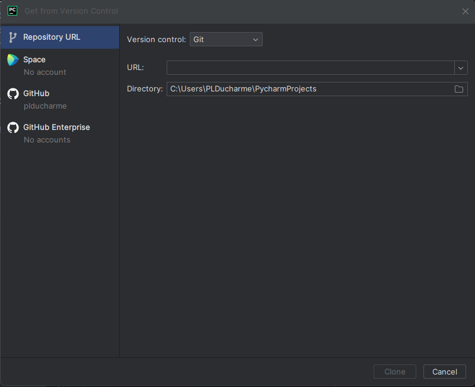

# Utilisation de Git et Github

1) Créer un compte sur 
[github.com](https://github.com/signup?ref_cta=Sign+up&ref_loc=header+logged+out&ref_page=%2F&source=header-home) si vous n'en possédez pas
2) Vous avez maintenant un espace pouvant contenir des dépôts publics à l'adresse https://github.com/<nom_usager>
3) Allez à l'adresse suivante [https://github.com/plducharme/420-SD2-HY-H24](https://github.com/plducharme/420-SD2-HY-H24)
4) Cloner le dépôt
- Copier le lien HTTPS du dépot

- Dans Pycharm, sous le menu Git ou VCS (ou dans le menu d'accueil)
  - Si aucun projet n'est présent ou si Git n'est pas encore installé, le menu VCS sera présent. Dans ce cas, utiliser l'item "Get from version control"
  - Si Git est présent, le menu Git contiendra l'item "Clone..." 

Ceci clonera ce dépôt-ci. Ce dépôt contient les exercices en classe pour la session.

# Héritage et Polymorphisme
1) Créer une classe représentant un instrument de musique
- Cette classe devra contenir des propriétés représentant un instrument
- Vous devez respecter l'encapsulation
- Ajouter 2 méthodes avec une implémentation de base (peut être un print())

2) Créer deux classes enfants qui représenteront des instruments de musique spécifique (guitare, piano, guimbarde, etc)
- Ces classes devront contenir des propriétés spécifiques à ces instruments
- Ajouter une méthode spécifique à chaque classe
- Redéfinir une des méthodes de la classe parente
- Respectez l'encapsulation
- Appelez les divers constructeurs et méthodes pour observer les résultats

# Dépôt Git personnel
- Créez un nouveau dépôt personnel dans votre Github.
- Ajoutez un fichier python à votre dépôt.
- Modifiez le fichier
- Faire un commit local
- Faire un push vers dépôt distant
